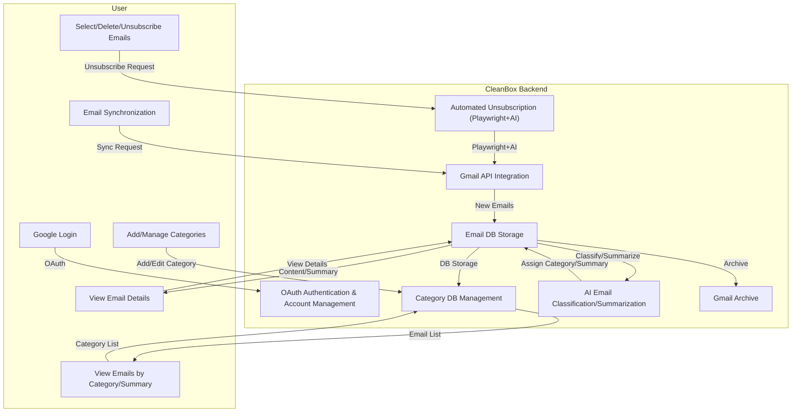

# CleanBox: AI Email Classification & Automated Unsubscription

CleanBox is an integrated email management service that connects with Gmail and uses AI to automatically classify, summarize, and even unsubscribe from emails.

---

## 🏗️ System Architecture



---

## Key Features

### 1. Google OAuth Login & Multi-Account Support
- Secure login with Google OAuth
- Connect and switch between multiple Gmail accounts

### 2. Category Management
- Add, edit, and delete user-defined categories (name/description)
- Automatically classify emails by category

### 3. AI-based Email Classification & Summarization
- Uses OpenAI API to classify emails by content/subject/sender
- AI generates summaries for each email

### 4. Email Synchronization & Archiving
- Real-time sync of new emails via Gmail API (webhook/manual)
- Archive emails in Gmail after classification/summarization

### 5. Category-based Email List/Summary/Details
- Click a category to view email list and AI summary
- Click an email to view full content/summary/metadata

### 6. Bulk Actions & Automated Unsubscription
- Select multiple emails to delete or unsubscribe in bulk
- Unsubscribe: Automatically visits the "unsubscribe" link in the email using Playwright+AI

---

## Tech Stack
- **Backend**: Python, Flask, SQLAlchemy
- **AI**: OpenAI API (GPT)
- **Email**: Google Gmail API, Webhook
- **Browser Automation**: Playwright (headless, AI agent)
- **DB**: PostgreSQL
- **Frontend**: Bootstrap, Jinja2
- **Deployment**: Docker, Render

---

## Installation & Usage

1. Clone the repository
```bash
git clone https://github.com/your-username/cleanbox-app.git
cd cleanbox-app
```
2. Create virtual environment & install dependencies
```bash
python -m venv venv
source venv/bin/activate
pip install -r requirements.txt
```
3. Set environment variables
```bash
cp env.example .env
# Edit the .env file (Google, OpenAI, DB, etc.)
```
4. Run the app
```bash
python app.py
```

### Docker
```bash
docker build -t cleanbox-app .
docker run -p 8000:8000 cleanbox-app
```

---

## Example Environment Variables
```env
GOOGLE_CLIENT_ID=...
GOOGLE_CLIENT_SECRET=...
OPENAI_API_KEY=...
DATABASE_URL=...
CLEANBOX_SECRET_KEY=...
CLEANBOX_ENCRYPTION_KEY=...
```

---

## Testing
```bash
pytest
```

---

## License
MIT License

---

## Issues/Contact
- Issues/PRs are welcome
- For questions, please leave a GitHub Issue.
