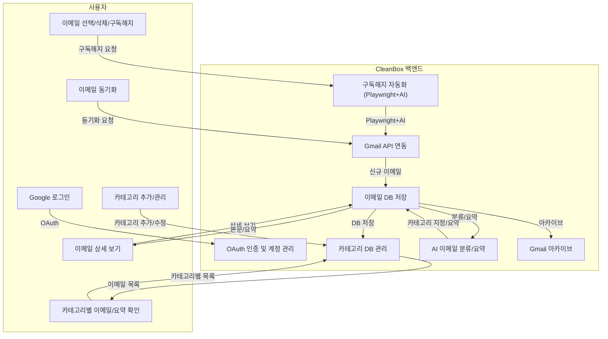

# CleanBox: AI 이메일 분류 및 구독해지 자동화

CleanBox는 Gmail과 연동하여 AI가 이메일을 자동 분류·요약하고, 구독해지까지 지원하는 통합 이메일 관리 서비스입니다.

---

## 🏗️ 시스템 아키텍처



---

## 주요 기능

### 1. Google OAuth 로그인 및 멀티 계정 지원
- Google OAuth로 안전하게 로그인
- 여러 Gmail 계정 연동 및 전환 가능

### 2. 카테고리 관리
- 사용자 정의 카테고리(이름/설명) 추가·수정·삭제
- 카테고리별로 이메일 자동 분류

### 3. AI 기반 이메일 분류 및 요약
- OpenAI API를 활용해 이메일 본문/제목/발신자 기반으로 카테고리 분류
- 각 이메일에 대해 AI가 요약 생성

### 4. 이메일 동기화 및 아카이브
- Gmail API로 신규 이메일 실시간 동기화 (웹훅/수동 동기화)
- 분류/요약 후 Gmail에서 자동 아카이브 처리

### 5. 카테고리별 이메일 목록/요약/상세
- 카테고리 클릭 시 해당 이메일 목록 및 AI 요약 제공
- 개별 이메일 클릭 시 원본 본문/요약/메타데이터 확인

### 6. 대량 작업 및 구독해지 자동화
- 여러 이메일 선택 후 삭제/구독해지 일괄 처리
- 구독해지: 이메일 내 "unsubscribe" 링크 탐색 → Playwright+AI로 실제 구독해지 페이지 자동 방문 및 폼 처리

---

## 기술 스택
- **Backend**: Python, Flask, SQLAlchemy
- **AI**: OpenAI API (GPT)
- **Email**: Google Gmail API, Webhook
- **Browser Automation**: Playwright (headless, AI agent)
- **DB**: PostgreSQL
- **Frontend**: Bootstrap, Jinja2
- **배포**: Docker, Render

---

## 설치 및 실행

1. 저장소 클론
```bash
git clone https://github.com/your-username/cleanbox-app.git
cd cleanbox-app
```
2. 가상환경 및 의존성 설치
```bash
python -m venv venv
source venv/bin/activate
pip install -r requirements.txt
```
3. 환경변수 설정
```bash
cp env.example .env
# .env 파일 편집 (Google, OpenAI, DB 등)
```
4. 실행
```bash
python app.py
```

### Docker
```bash
docker build -t cleanbox-app .
docker run -p 8000:8000 cleanbox-app
```

---

## 환경 변수 예시
```env
GOOGLE_CLIENT_ID=...
GOOGLE_CLIENT_SECRET=...
OPENAI_API_KEY=...
DATABASE_URL=...
CLEANBOX_SECRET_KEY=...
CLEANBOX_ENCRYPTION_KEY=...
```

---

## 테스트
```bash
pytest
```

---

## 라이선스
MIT License

---

## 문의/기여
- 이슈/PR 환영
- 궁금한 점은 GitHub Issue로 남겨주세요.
